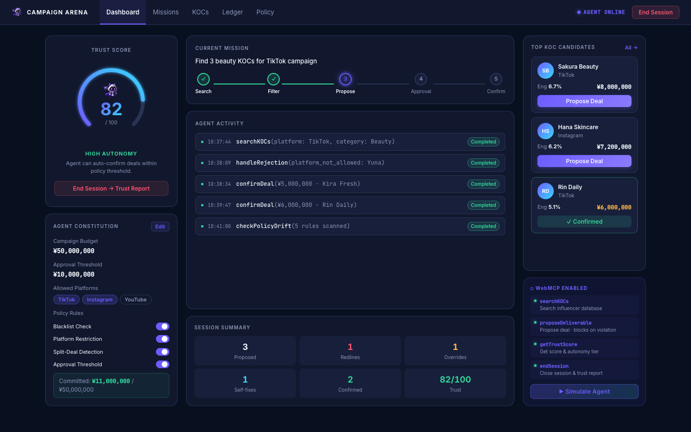

<div align="center">
  
  <h3>Campaign Arena</h3>
  <p>AI-powered KOC campaign manager that blocks and waits for human approval — built on WebMCP.</p>

  [](LICENSE)
  [](https://webmcp.dev)
  [](index.html)
</div>

---



## What it does

Campaign Arena lets an AI agent autonomously manage influencer (KOC) marketing campaigns — searching creators, proposing deals, and enforcing policy rules — while keeping a human in the loop for critical decisions.

Every deal proposal runs through a **Policy Engine**. When a violation is detected, the agent suspends execution and waits for a human to approve or reject before continuing. No silent overrides.

## Features

- **Human-in-the-loop by design** — `proposeDeliverable` is a real async Promise that resolves only when you click Approve or Reject
- **4 violation types** — blacklist, platform restriction, split-deal detection, and over-budget threshold
- **AEGIS Trust Score** — agent earns or loses trust based on behavior; score drives autonomy level (LOW / MEDIUM / HIGH)
- **Self-correction** — agent detects rejection reason and re-proposes with a corrected strategy
- **Zero dependencies** — single HTML file, no install, no bundler

## Getting Started

### Prerequisites

- A browser that supports WebMCP:
  - **ChatGPT desktop app** — in-app browser has WebMCP enabled by default
  - **Chrome 149+** — enable `chrome://flags/#enable-webmcp-testing`
- Or just a regular browser to explore the UI without an AI agent

### Run locally

```bash
# Option 1 — open directly (works for UI, WebMCP needs a server on some browsers)
open index.html

# Option 2 — serve locally
npx serve .
# or
python3 -m http.server 8080
```

No install step. No build step.

## Usage

### Exploring the UI

Open `index.html` in any browser. The dashboard shows:

- **KOC roster** — 10 influencers across TikTok, Instagram, YouTube
- **Policy panel** — live budget, platform allowlist, blacklist, approval threshold
- **Agent activity log** — every tool call the AI agent makes
- **Campaign ledger** — full deal history with violation events

Click **Propose Deal** on any KOC to trigger the Policy Engine manually.

### Testing with an AI agent

Open the page in a WebMCP-enabled browser, then instruct the agent:

```
Run a KOC campaign. Search for Beauty influencers on TikTok,
propose 3 deals, and handle any policy violations.
```

The agent will call `searchKOCs` → `proposeDeliverable` → block on violations → resume after your decision.

## WebMCP Tools

The page registers 4 tools via `document.modelContext.registerTool`:

| Tool | Description |
|---|---|
| `searchKOCs(platform?, category?)` | Search the KOC database with optional filters |
| `proposeDeliverable(kocKey)` | Propose a deal — blocks execution if a policy violation is detected |
| `getTrustScore()` | Returns current score, autonomy tier, and factor breakdown |
| `endSession()` | Close the session and display the final trust report |

### Violation scenarios

| Scenario | How to trigger |
|---|---|
| Blacklist | Propose **Luna Forbidden** |
| Platform not allowed | Propose **Yuna Trend** (YouTube, not in allowlist) |
| Split deal | Propose **Kira Fresh** (¥5M already committed → cumulative exceeds threshold) |
| Over approval threshold | Propose **Miyu Glow** (¥12M single deal > ¥10M limit) |

## How `waitForDecision` works

```js
// Agent calls proposeDeliverable → violation detected → execution suspends
waitForDecision(kocKey) {
  return new Promise(resolve => this.pending.set(kocKey, resolve));
}

// Human clicks Approve or Reject → Promise resolves → agent continues
approve(kocKey) {
  this.pending.get(kocKey)?.({ approved: true });
}
```

The AI agent's tool call stays open until the human acts. This is the core human-in-the-loop primitive.

## Stack

| | |
|---|---|
| UI | React 18 + Babel standalone (no bundler) |
| Protocol | WebMCP — `document.modelContext.registerTool` |
| Assets | 4 AEGIS mascot states (idle / violation / correcting / high-trust) |
| Hosting | Single `index.html` — deploy anywhere |

## License

MIT — see [LICENSE](LICENSE).
